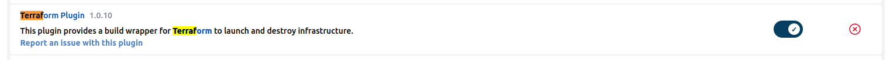
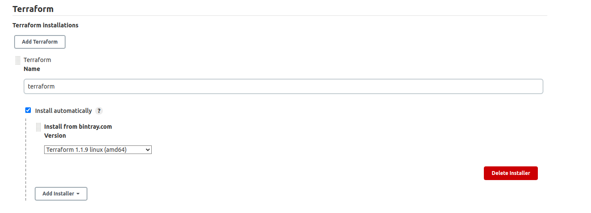
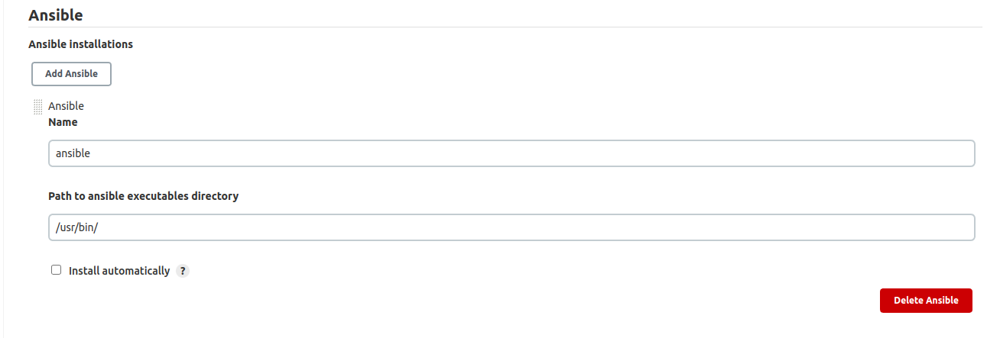

# Infrastructure provisioning and configuration pipeline
 
   

 
Jenkins pipeline runs **Terraform** to provision [resources on aws](./docs/Terraform.md), **Ansible** to configure 2 private instances to be a jenkins slave and install docker on it, and lastly invoking the pipelines responsible for deploying this [node app](https://github.com/Abdallah-Refay/nodejs_sample_app/tree/rds_redis) on these two instances by build the docker image and using these jenkinsfiles [Jenkinsfile](https://github.com/Abdallah-Refay/nodejs_sample_app/blob/rds_redis/Jenkinsfile), [Jenkins_private2](https://github.com/Abdallah-Refay/nodejs_sample_app/blob/rds_redis/Jenkins_private2).
 
 
 
## Getting started with **Jenkins**
 
I deployed jenkins master server as a docker custom image on my machine.
 
**First** you need to [install docker](https://docs.docker.com/engine/install/ubuntu/) on your machine
 
I used a custom image I built to deploy the master server which is basically a jenkins image with docker-ce-cli. You would need it if you want to run docker command but in our case we will not need it, so you can use the official jenkins image.
 
[official image](https://hub.docker.com/_/jenkins):
```
docker run jenkins
```
[my custom image](https://hub.docker.com/repository/docker/refay/jenkins_master):
```
docker run refay/jenkins_master:1.0
```
<br>

**Before heading to Jenkins** Configuration make sure to check [Terraform resources and configuration](docs/Terraform.md).
<br>

## Tools configuration on jenkins
 
**Note**: that other versions of tools or plugins may work but I mentioned the versions that worked for me.
<br><br>
**Terraform:**
 
I used terraform plugin version 1.0.10 check [plugins reference for terraform](https://plugins.jenkins.io/terraform/) for more info.

<br>
**Then** After Jenkins restarts, go to global tool configuration and terraform installation as follows.

<br><br>
**Ansible:**
 
I installed ansible as a deb package from apt package manager.
 
but first you need to exec into the container as root.
```
docker exec -it -u root <containe_name_or_id> bash
```
Then run
```
apt install ansible
```
after installing ansible you need to provide the binary path in the global tool configuration as follows:

 
 
<br>
 
## 🔗 Feedback
 
📧 abdallah.refaay2000@gmail.com
 
[](https://www.linkedin.com/in/abdallah-refaay/)
 
 
 

