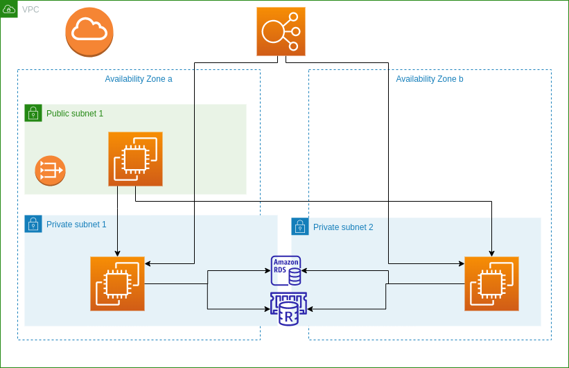

# Terraform resources
 
 

 
**First** make sure to configure your terraform backend with your s3 bucket and aws credentials, also make sure to check **prod.tfvars** file and feel free to change any of the variables with valid value for each variable.
 
 
Terraform infrastructure as code provisions the following:
 
## network module:
* VPC
* Internet gateway
* Nat gateway
* route tables
* 2 private subnets and 1 public subnet
 

## reds_redis module:
* db.t2.micro RDS Instance running mysql engine
* AWS elasticache cluster with single cache.t2.micro instance
 

## instances:
* public t2.micro ec2 in the public subnet
* private t2.micro ec2 in the private subnet1
* private t2.micro ec2 in the private subnet2
 
 
 
## Network load balancer:
Load balancer that targets the 2 private instance that exposes the node app on port 3000
  

## Security groups:
Mainly controls ingress connection on public and private instances on specific ports.
 
 

